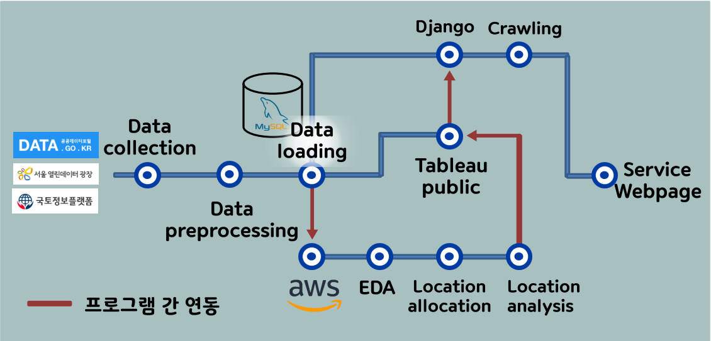
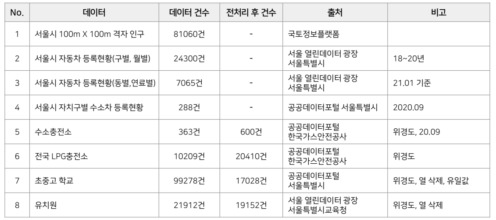
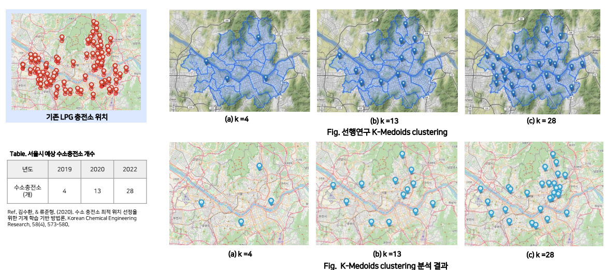
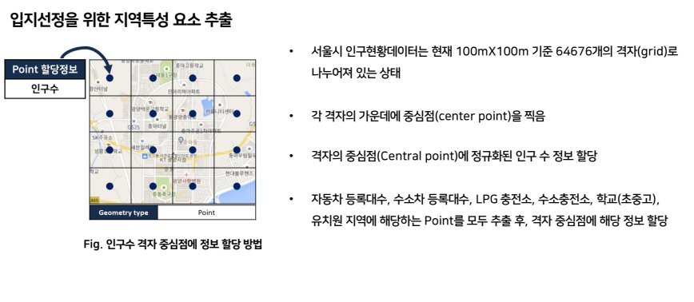
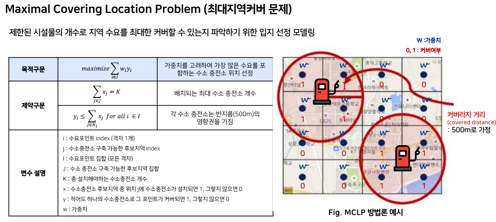
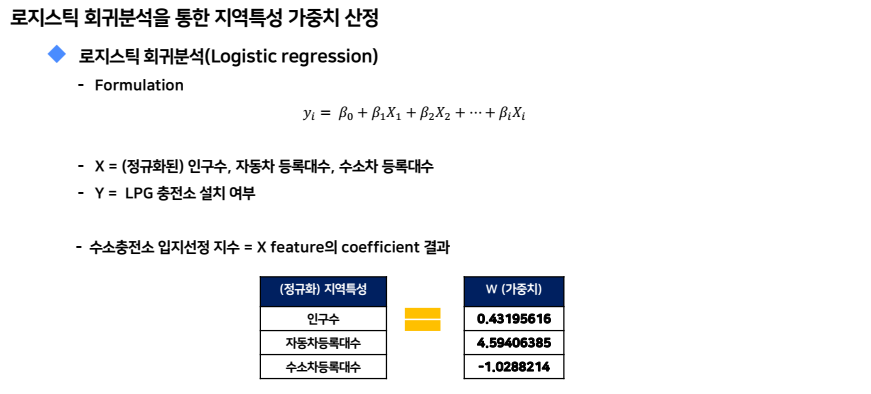
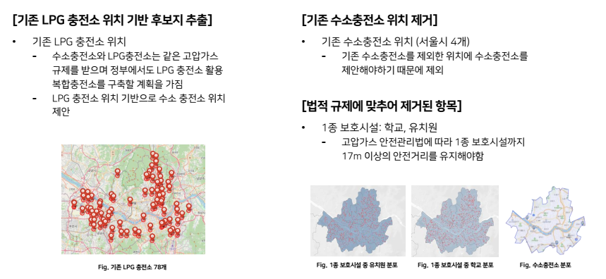
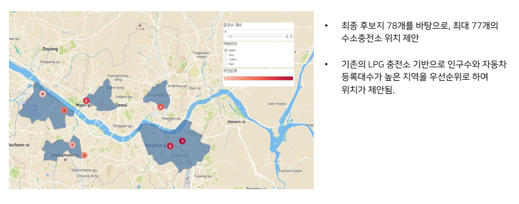
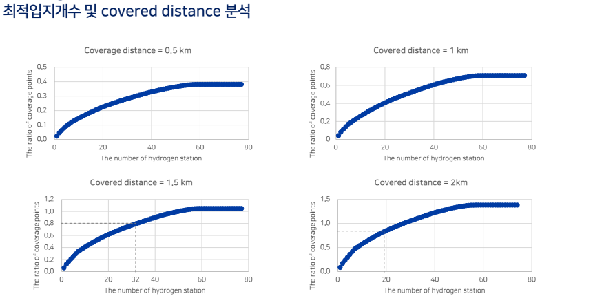
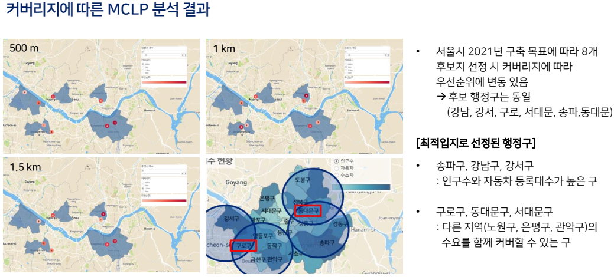

# 수소충전소 **구축 입지 선정 의사결정 지원시스템**
> 수소충전소 특수목적법인(SPC: 하이넷, 코하이젠), 정부기관(환경부, 국토부), 외 이해관계자를 대상으로 수소충전소의 수요 및 고압가스 규제를 반영한 서울 내 수소충전소 구축 입지 선정 의사결정 지원시스템

## Introduction
- Full demo video  [ [link](https://github.com/goareum93/H2_station/tree/master/08%2C%20Demo) ]

<video src="08, Demo/Demo.mp4"></video>

- Final Report  [ [link](https://github.com/goareum93/H2_station/blob/master/07%2C%20%EC%B5%9C%EC%A2%85%EC%82%B0%EC%B6%9C%EB%AC%BC/%EB%B0%9C%ED%91%9C%EC%9E%90%EB%A3%8C/4%EC%A1%B0_%ED%95%A0%EC%88%98%EC%9E%88%EC%A1%B0_%EB%B0%9C%ED%91%9C.pdf) ]

## Project Process

## Dataset

## Models
### k-medoids clustering

### Maximal Covering Location Problem(MCLP) [[link](https://github.com/cyang-kth/maximum-coverage-location)]

## Result

## Reference

[[link](https://www.notion.so/8ed2c2ead3f349edae2b66860775fe55?v=57aaeccf3f354da58c0ad2b215e10947)]

